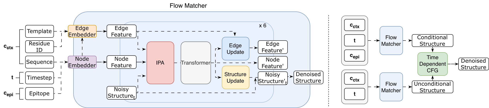
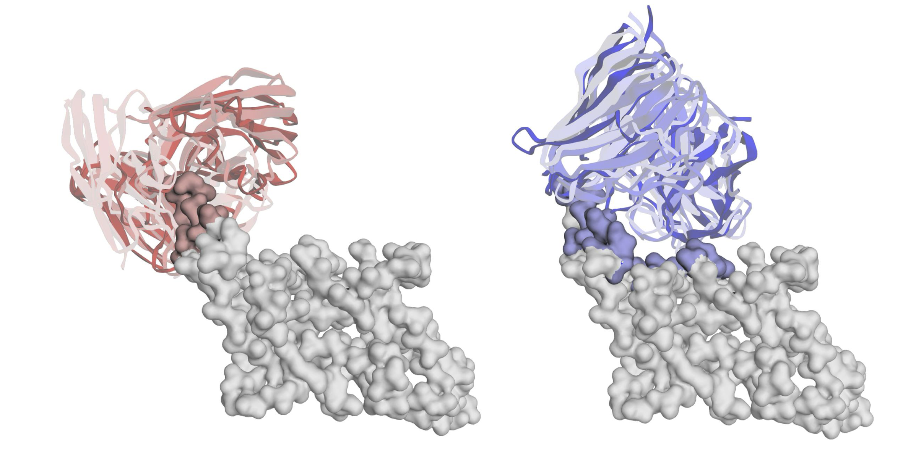
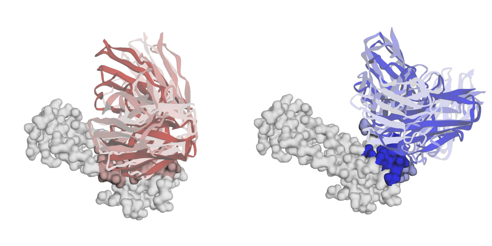

# TiDE-Ab: De Novo Epitope-Specific Antibody Design via $SE(3)$ Flow Matching

TiDE-Ab introduces a robust generative framework for de novo epitope-specific antibody design.
By leveraging Conditional $SE(3)$ Flow Matching and a novel Time-Dependent Classifier-Free Guidance (TD-CFG) strategy, TiDE-Ab generates physically plausible antibody backbones and accurate global binding poses without relying on pre-aligned templates.
Our approach employs a dynamic guidance schedule that prioritizes global docking cues in the early generative stages and facilitates local structural refinement in later stages, effectively eliminating the steric clashes and trajectory instabilities common in static guidance methods.




## 💊 Therapeutic Case Studies

TiDE-Ab demonstrates high practical utility by navigating complex therapeutic design scenarios that require programmable binding specificity.
By successfully targeting a wide range of user-defined epitopes on the same antigen —from highly selective patches to broad conserved surfaces— TiDE-Ab ensures generated backbones strictly adhere to precise geometric constraints, transforming de novo design into a highly controllable and programmable engineering process.


<table align="center" width="95%">
  <tr valign="top">
    <td align="center" width="45%">
      <b> Case Study 1: TGF-β</b><br><br>
      <br><br>
      <sub><b>TGF-β3 Selective vs. Pan-TGF-β</b></sub>
    </td>
    <td align="center" width="45%">
      <b> Case Study 2: IL-17A</b><br><br>
      <br><br>
      <sub><b>IL-17A/F Dual vs. IL-17A Selective</b></sub>
    </td>
  </tr>
</table>


## ⚙️ Installation

Select an installation method based on your environment. **Conda** is highly recommended for a clean setup. These guides assume you are using **CUDA 12.4**.

### Option 1: Quick Install (Conda)
*Best if your system supports CUDA 12.4. This sets up everything in one command.*

```bash
# Create and activate conda environment
conda env create -f environment.yml
conda activate tideab
```

### Option 2: Step-by-Step Install (Pip)

*Best for custom setups or different CUDA versions.*

**1. Environment Setup**
```bash
conda create -n tideab python=3.10 -y
conda activate tideab
```

**2. Install PyTorch & Specialized Packages** (*Change `cu124` to `cu118` or other versions if necessary*)
```bash
pip install torch torchvision torchaudio --index-url https://download.pytorch.org/whl/cu124
pip install torch-scatter -f https://data.pyg.org/whl/torch-$(python -c "import torch; print(torch.__version__.split('+')[0])")+cu124.html
```

**3. Install Remaining Dependencies**
```bash
pip install -r requirements.txt
```


## 📂 Data Preparation
The model is trained on antibody-antigen complexes from the **SAbDab** database (cutoff: April 30, 2020). The dataset is managed through metadata files in `data/splits/`.

```bash
├── data
│   └── splits
│       ├── metadata_train.csv
│       ├── metadata_val.csv
│       └── metadata_test.csv
```

The metadata files in data/splits/ follow this schema:
| Column | Description |
| :--- | :--- |
| **pdb_name** | Unique identifier for the complex (e.g., `1yy9_D_C_A`). |
| **num_chains** | Total number of chains in the structure. |
| **seq_len** | Total sequence length of the complex. |
| **cluster** | Interaction cluster ID used for balanced sampling. |


## 🚀 Running the Code

### Training

Run with default settings or override parameters via command line:
```bash
python train.py experiment.optimizer.lr=0.0005  # (Optional) parameter override
```

### Inference

**1. Download Pre-trained Weights**
   Download [**weights.pt**](https://drive.google.com/file/d/1VApyhdaiZxcULLts_a34n9RbB0JNOFoZ/view?usp=share_link) and place it in any directory of your choice (e.g., `checkpoints/`).

**2. Run Inference on Test Set**
   Provide the path to your weights and the desired output directory as arguments:
   ```bash
   python inference.py weight_path=<PATH_TO_WEIGHTS> inference_dir=<OUTPUT_DIR>
   ```


## 🙏 Acknowledgements

This codebase is developed based on the [**FrameFlow**](https://github.com/microsoft/protein-frame-flow/tree/main) repository. We thank the original authors for their pioneering work on $SE(3)$ flow matching for protein structures.
